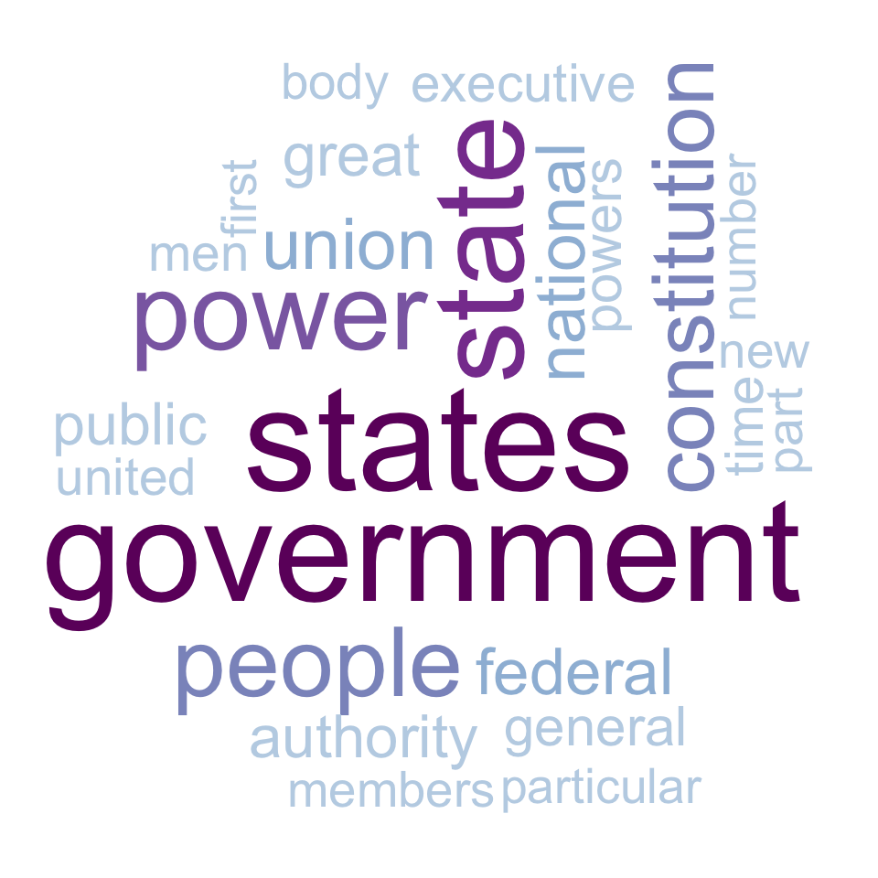
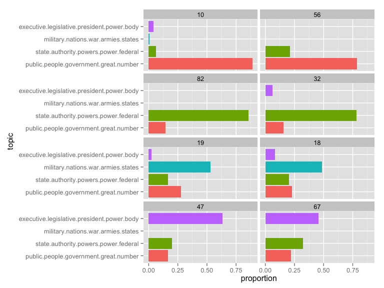
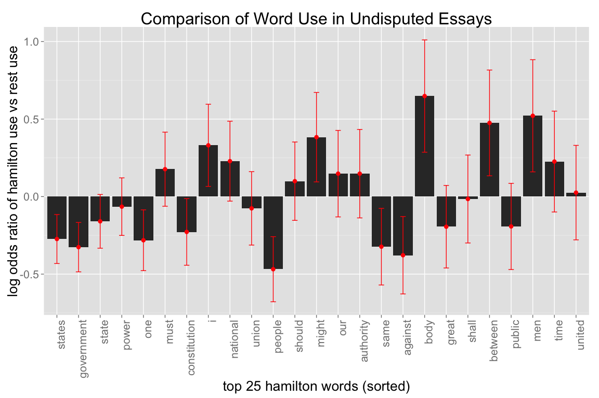

Federalist Papers Analysis
========================================================
We perform analysis on the 85 essays comprising the Federalist Papers using the
following packages.


```r
library(tm); library(ggplot2); library(wordcloud); library(lda); 
library(reshape2); library(SnowballC)
source("preprocess.R")
load("federalist.RData")
```


Word Cloud of Non-Stop Words
--------------------------------------------------------
We display a word cloud of the non-stop words (I, me, and, them, etc.) used in the 85 essays.  No surprises.  
 


Latent Dirichlet Allocation
--------------------------------------------------------
We run the Latent Dirchlet Allocation method on the essays setting 4 topics for
10000 simulations.  For each topic (columns) we post the top 5 words in terms of their probabilities.  

```
##      [,1]       [,2]         [,3]          [,4]       
## [1,] "nations"  "people"     "executive"   "state"    
## [2,] "war"      "government" "legislative" "federal"  
## [3,] "military" "great"      "president"   "states"   
## [4,] "foreign"  "different"  "power"       "authority"
## [5,] "armies"   "public"     "senate"      "power"
```
The four topics appear to relate to 

1. Democracy
2. The relationship between the state and federal governments
3. Military affairs
4. The executive branch of the government.  

For each of the 4 topics, we present the topic distribution of the 2 documents with the highest proprotion for that topic, with the essay number as the header.  

 


Log-odds of word use for certain authors vs others
--------------------------------------------------------
For the 69 essays whose authorship is not dispute, we analyse the usage of the top 25 words Hamilton used by comparing the log-odds ratio of Hamilton vs Madison & Jay's use of that word, as measure by the proportion.  The red error bars a 95% percent confidence intervals based on an asymptotic approximation of the standard error.  
 
Even though the words "states" and "government" were the top two words used by Hamilton, Hamilton used it far less proportionally than Jay and Madison.  Interestingly Hamilton used the word "I" at a much higher rate than the others.  


