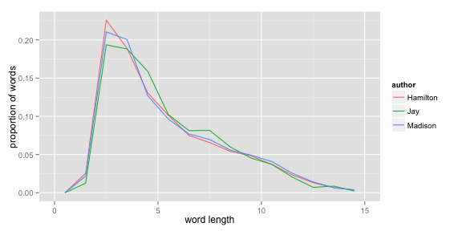
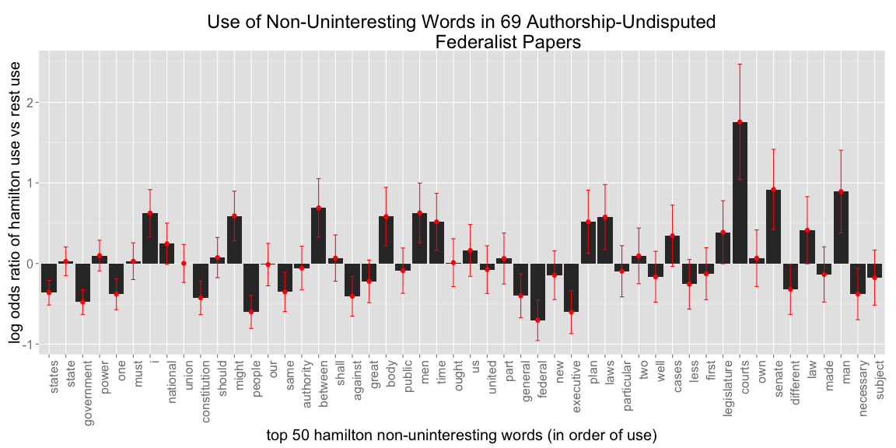

Federalist Papers Analysis Project Log
========================================================


```r
source("./analysis.R")
```


2013-10-27 (Sunday)
--------------------------------------------------------
Today I:

* I cleaned up the code to look at words/sentence and char/word (word length) for the three authors
* Started looking at which words were used by who, in particular considering the log odds ratio of the use of different words by each of the three others vs the other two

Some interesting observations:

### Words per sentence
It appears that John Jay used slightly longer sentences than Madison and Hamilton.  Not much difference between Hamilton and Madison


```r
ggplot(word.per.sen, aes(n.word)) + geom_freqpoly(aes(y = ..density.., group = author, 
    colour = author), binwidth = 10) + xlim(0, 100) + ylab("proportion of sentences") + 
    xlab("words per sentence")
```

 

```r
summary(model.word.per.sen)
```

```
## 
## Call:
## lm(formula = n.word.per.sen ~ authors.sen)
## 
## Residuals:
##    Min     1Q Median     3Q    Max 
## -33.15 -14.24  -4.15   9.85 145.02 
## 
## Coefficients:
##                    Estimate Std. Error t value Pr(>|t|)    
## (Intercept)          33.983      0.354   95.97   <2e-16 ***
## authors.senJay        4.256      1.646    2.59   0.0098 ** 
## authors.senMadison    0.171      0.698    0.25   0.8060    
## ---
## Signif. codes:  0 '***' 0.001 '**' 0.01 '*' 0.05 '.' 0.1 ' ' 1
## 
## Residual standard error: 20.3 on 4570 degrees of freedom
## Multiple R-squared:  0.00146,	Adjusted R-squared:  0.00102 
## F-statistic: 3.34 on 2 and 4570 DF,  p-value: 0.0354
```


### Characters per word i.e. word length
There is mild evidence that John Jay used longer words than Hamilton, and strong evidence that Madison did.  We must be careful not to interpret this as some sort of causal statement, as the nature of the topic of the essays they wrote about may have involved longer words, and therefore does not reflect their general writing abilities.

```r
ggplot(char.per.word, aes(n.char)) + geom_freqpoly(aes(y = ..density.., group = author, 
    colour = author), binwidth = 1) + xlim(0, 15) + ylab("proportion of words") + 
    xlab("word length")
```

 

```r
summary(model.char.per.word)
```

```
## 
## Call:
## lm(formula = n.char.per.word ~ authors.word)
## 
## Residuals:
##    Min     1Q Median     3Q    Max 
## -3.894 -1.894 -0.789  2.107 14.211 
## 
## Coefficients:
##                     Estimate Std. Error t value Pr(>|t|)    
## (Intercept)          4.78943    0.00855  559.90  < 2e-16 ***
## authors.wordJay      0.10497    0.03760    2.79   0.0052 ** 
## authors.wordMadison  0.10363    0.01683    6.16  7.4e-10 ***
## ---
## Signif. codes:  0 '***' 0.001 '**' 0.01 '*' 0.05 '.' 0.1 ' ' 1
## 
## Residual standard error: 2.86 on 156271 degrees of freedom
## Multiple R-squared:  0.000271,	Adjusted R-squared:  0.000258 
## F-statistic: 21.1 on 2 and 156271 DF,  p-value: 6.55e-10
```


### Differences in words used by the three authors
We now consider the use of "non-uninteresting" words by the three authors.  Uninteresting words consist of particles and the like: and, there, by, or, etc.  We consider the use of different words by, say, Hamilton, vs the other two authors via the log-odds ratio, where positive values denote a greater use by Hamilton.  In the following plot, we consider the top 50 non-uninteresting words used by Hamilton.  We observe that, for example, although Hamilton did use the word "states" the most frequently, he did so much less often than Madison and Jay did.  We also plotted confidence bands on the log odds-ratio.  


```r
top.words.data <- data.frame(words = words, log.odds.ratio = log.odds.ratio, 
    se = se)
top.words.data$words <- factor(top.words.data$words, levels = top.words.data$words)
ggplot(top.words.data, aes(x = words, y = log.odds.ratio)) + geom_bar(stat = "identity") + 
    theme(text = element_text(size = 20), axis.text.x = element_text(angle = 90, 
        hjust = 1)) + geom_errorbar(limits, position = dodge, width = 0.25, 
    col = "red") + geom_point(col = "red", size = 3) + labs(x = sprintf("top %i %snon-uninteresting words (in order of use)", 
    n.words, words.author), y = sprintf("log odds ratio of %suse vs rest use", 
    use.author), title = sprintf("Use of Non-Uninteresting Words in %i Authorship-Undisputed\n                  Federalist Papers", 
    length(undisputed)))
```

 

Interestingly, Hamilton uses the word "I" a lot more, also about "laws", "courts", and of "men".  Could he be waxing philosophical?  Also, the negatives primarily reflect Madison, since he wrote 14 out of the 18 other essays.  


I still need to
* Sanity check this code
* Figure out what to do about plurals:  states vs state
